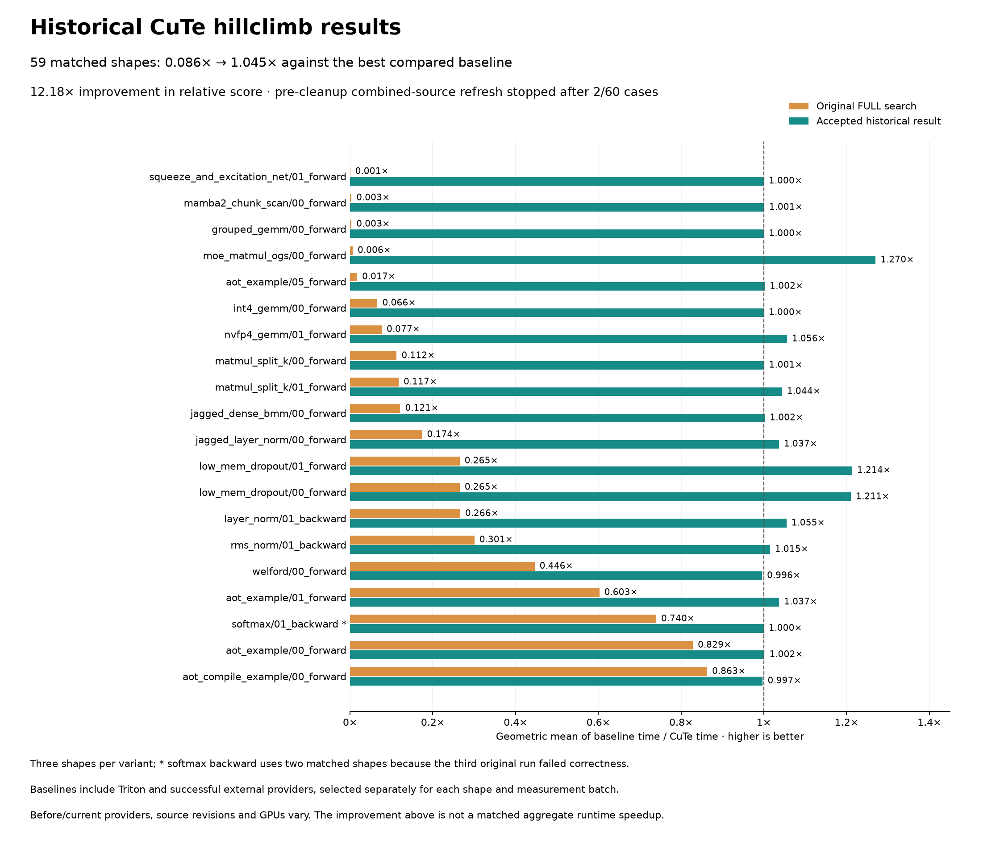

# [noland] CuTe worst20 hillclimb — historical results and cleanup record

The 13 logical production commits passed the selected qualification scope: independent review, focused default/CuTe checks and lint for each prefix, and both full suites on the corrected final production tree. This report records accepted historical measurements and adds no measurements. Performance launches stopped when work switched to history cleanup.

## Accepted historical results

The accepted record covers **20 non-attention variants × three shapes: 60/60 within the 1% target**, with a geometric-mean relative score of **1.04408589×**. There are 30 strict wins, 18 exact ties and 12 cases between 0.99× and 1.00×. A score is best compared baseline time divided by CuTe time; higher is better.

For the **59 cases with valid original FULL-autotune measurements**, the geometric mean changed from **0.0857792187× to 1.0448450843×**, yielding a **12.18063185× improvement in relative score**. Only 6/59 original cases met the target. The third original softmax-backward shape failed correctness and is excluded from that matched set; its valid accepted result is included in the current 60-case aggregate.

These results combine accepted source revisions, selected providers and GPU batches. Each accepted baseline/CuTe comparison used the same GPU and timer, with interleaved confirmation where recorded. The aggregate quotient is **not a matched final-stack runtime speedup**. The hardware was NVIDIA B200 at a 750 W power limit. Provider selection includes Triton and successful external implementations, and varies by case and batch.



[PDF](cute-worst20-hillclimb/before-after.pdf), [unchanged comparison data](cute-worst20-hillclimb/data.json), [renderer](cute-worst20-hillclimb/render.py), and [exact per-case provenance](cute-worst20-hillclimb/row-provenance.json). The renderer reads saved ratios and changes only the presentation; it does not benchmark.

| Target variant | Original score | Accepted score | Matched shapes |
|---|---:|---:|---:|
| `squeeze_and_excitation_net/01_forward` | 0.000673 | 1.000000 | 3 |
| `mamba2_chunk_scan/00_forward` | 0.003362 | 1.000871 | 3 |
| `grouped_gemm/00_forward` | 0.003396 | 1.000269 | 3 |
| `moe_matmul_ogs/00_forward` | 0.006391 | 1.269993 | 3 |
| `aot_example/05_forward` | 0.017171 | 1.002374 | 3 |
| `int4_gemm/00_forward` | 0.066280 | 1.000000 | 3 |
| `nvfp4_gemm/01_forward` | 0.076525 | 1.055953 | 3 |
| `matmul_split_k/00_forward` | 0.112466 | 1.000652 | 3 |
| `matmul_split_k/01_forward` | 0.117498 | 1.044158 | 3 |
| `jagged_dense_bmm/00_forward` | 0.121162 | 1.002365 | 3 |
| `jagged_layer_norm/00_forward` | 0.174060 | 1.036667 | 3 |
| `low_mem_dropout/01_forward` | 0.264901 | 1.213580 | 3 |
| `low_mem_dropout/00_forward` | 0.265131 | 1.210596 | 3 |
| `layer_norm/01_backward` | 0.266262 | 1.054752 | 3 |
| `rms_norm/01_backward` | 0.300711 | 1.014888 | 3 |
| `welford/00_forward` | 0.446218 | 0.995834 | 3 |
| `aot_example/01_forward` | 0.602593 | 1.036826 | 3 |
| `softmax/01_backward` | 0.740051 | 0.999700 | 2 |
| `aot_example/00_forward` | 0.828550 | 1.001656 | 3 |
| `aot_compile_example/00_forward` | 0.863143 | 0.997337 | 3 |
| **59 matched cases, geometric mean** | **0.0857792187** | **1.0448450843** | **59** |

The accepted INT4 shape1 result reached **10.176 µs**, matching torch.compile, after a retained control at 12.224 µs. On squeeze-and-excitation shape0, replaying the stronger historical Triton configuration produced **CuTe = Triton = 8.064 µs**, with torch.compile at 12.160 µs. The earlier apparent 1.238× win against a weaker Triton result remains excluded.

The pre-cleanup combined-source refresh completed **2/60 cases** and was then stopped. It is incomplete. The accepted 60-case historical aggregate must not be presented as 60 measurements of the rebased, extracted submission stack. No running-job or future-completion claim is made here.

## Implementation summary

The implementation is arranged into 13 independently reviewed production commits on upstream `54166b50ec42bfe7f26b3220bb0bb24d00384c29`, ending at `ef3dd4c5fc8d119dffdcb0e7bc28f62d2277d293`. The ordered commits and their qualification appear below. This report is the single `[noland]` documentation payload.

- Benchmark and runtime changes preserve public allocating callers, compare independently pinned providers, isolate finalist processes and mutable argument storage, clear whole-caller launch caches, and track compiled helper source identity.
- Compiler proofs and structural transforms cover safe scalar/vector motion, complete-tile and address/alias facts, region fission, full-slice and segmented matrix tiling, flattened reductions, and materialized operands with owned intermediate storage.
- Matrix work exposes block-scaled and gathered operands, grouped FP32 conversion/descriptor/prefix schedules, split-K workspace/finalizer choices, and proved programmatic dependent launch from a SIMT materialization producer to its MMA consumer. Search/config/launch hooks accompany their implementations.
- Reduction work includes resident reductions and ordered sequences, bounded cached variants with complete fallback callers, and host paired/single-sum fusion. Vector packet reductions and prefetch retain tail, alignment, alias and rounding constraints.
- Autotuner/runtime work adds legal coverage witnesses, strict config transfer and round trips, backend policy-aware cache/AOT identity, and structural settings. Config choices are generic; test or example names do not select kernels.

**Authorized Philox mapping change.** On 2026-09-19, the user explicitly approved “Allow a different deterministic Philox mapping” and “Allow the random-stream change.” The new stream maps logical offset `i` to `Philox(seed, floor(i/4))[i mod 4]` and can use all four outputs per counter. It intentionally changes deterministic seed-to-mask values relative to the old word0 stream. Distribution, repeatability for a fixed seed/policy, allocating caller, dtype/scale/view/error behavior remain required. Explicit `word0` retains the legacy policy. The effective constructor default is `auto` on CuTe and `word0` elsewhere; the choice is preserved by settings, reference mode and reproduction. The exact authorization is recorded in the pinned accepted goal notes, without changing any score merely because permission was given.

## Verification boundaries

Historical source **Q**, manifest `b2ad67586e96fe258b347b2dcc553d036687dcc9ed343fd0553ffc5f55088072`, has a completed verification receipt: **14,349 CuTe tests + 1,150 subtests**, and **13,782 default tests + 698 subtests**, plus lint and independent review. Its receipt is `artifacts/worst20-2026-09-12/proposals/cute-paired-config-roundtrip-v1-review/root-full-verification-v1.json` (SHA-256 `ff49c8a7ef46343c36b2699be6cb1326a86e20f01e5b4ac2b6293e8eef50cd9b`). Those results apply to Q, not automatically to later rebase, extraction or repairs.

**Production-stack verification: passed.** The selected scope is recorded in `artifacts/stack-cleanup-2026-09-22/qualification-after-final-repairs-root-v3.json`. It was satisfied by independent review of all 13 logical production commits, focused default/CuTe checks and lint for each prefix, and both full suites on the corrected final production tree. Prefixes 1–2 reuse their exact unchanged rebased focused/lint results; prefixes 3–13 passed fresh checks after the compiler and test repairs. Focused checks are not full per-prefix `cute-verify` runs.

Focused execution provenance uses `artifacts/stack-cleanup-2026-09-22/repaired-prefix-checks-v3` for all prefixes 3–13. Earlier partial and interrupted prefix runs remain preserved and are excluded from these passing counts. Every successful result references the exact corrected prefix and target list.

Upstream base: `54166b50ec42bfe7f26b3220bb0bb24d00384c29`. Corrected qualification preview: `be3641aa5dcc365ca835f2729f9b57de54d31903`; verified final production source tree: `5a19bc46e7272a590543c3964278c050a885f9df`. Final production tip: `ef3dd4c5fc8d119dffdcb0e7bc28f62d2277d293`. All 13 normal-hook commits match their checked prefix trees exactly. The single `[noland]` documentation commit follows production qualification. Earlier preparatory runs exposed exact-row-mask admission failures in gathered MMA, an outdated jagged-load source assertion, and capability-cache leakage from CPU-only fixtures. Those failed or interrupted attempts remain preserved and are not completed final verification.

Older prefixes 1–9 completed both full suites on their own historical source trees. Old prefix 10 failed three default-suite tests because of a latent K-tail load-mask defect; it is not a passing full result. Old prefixes 11–13 did not complete their full suites. Those records remain preserved and cannot be substituted for the corrected final-tree full pair. The common mask and CPU-fixture repairs are assigned to prefix 3, the collective runtime regressions to prefix 6, and the gathered admission repair to prefix 10.

| # | Logical scope | Final normal commit | Historical full-suite evidence | Focused default / CuTe | Lint / independent review |
|---:|---|---|---|---|---|
| 01 | Baseline comparison | `bf025344ee4559fccbcdd2fa258d6f46fe99a841` | Completed on historical tree | Reuse unchanged results: 6 passed; 12 subtests; 1 skipped; 0 xfailed / 5 passed; 12 subtests; 2 skipped; 0 xfailed; source/results: `artifacts/stack-cleanup-2026-09-22/rebased-prefix-checks-v1/01/manifest.json` (SHA-256 `9184f682c91423c172f56c789fc54ac6c213a2835dfba6d78b643025a4d344a8`) | Pass / Codex; lint: `artifacts/stack-cleanup-2026-09-22/rebased-prefix-checks-v1/01/lint/result.json` (SHA-256 `ee0d729153a432dcf9133375a53d4ed9d42658b383d95ab6baa9fdab2b3df254`); review pins in joined evidence |
| 02 | Cached CuTe launch alignment | `fae17990f34fd1f71b808da046dfc93a170706c2` | Completed on historical tree | Reuse unchanged results: 6 passed; 12 subtests; 1 skipped; 0 xfailed / 5 passed; 12 subtests; 2 skipped; 0 xfailed; source/results: `artifacts/stack-cleanup-2026-09-22/rebased-prefix-checks-v1/02/manifest.json` (SHA-256 `36a5391a4bbbef426791923852a97702cc0e473f3d27db6ae9d7dcc1ff7fe865`) | Pass / Codex; lint: `artifacts/stack-cleanup-2026-09-22/rebased-prefix-checks-v1/02/lint/result.json` (SHA-256 `1200dafb4eb7aa873ce27ebf2843617de2d4775f9dc61786ea8686e9b3b54523`); review pins in joined evidence |
| 03 | Common compiler semantics and masks | `41d139f2370b180791412798d6ca9222e4d42672` | Completed on historical tree | Fresh run: 51 passed; 12 subtests; 1 skipped; 0 xfailed / 50 passed; 12 subtests; 2 skipped; 0 xfailed; source/results: `artifacts/stack-cleanup-2026-09-22/repaired-prefix-checks-v3/03/manifest.json` (SHA-256 `ce8fb174671741163cee7b53b72b0611bf56510d53cbd67436b7bbcf27404140`) | Pass / Codex; lint: `artifacts/stack-cleanup-2026-09-22/repaired-prefix-checks-v3/03/lint.json` (SHA-256 `732bf4b5203917601bb510b0270e15ed7effccd4197f1ac4db106ba98c536848`); review pins in joined evidence |
| 04 | Native MMA and host transforms | `6a917a62ac91bac2e2cf234acf7e1bf0e8119c07` | Completed on historical tree | Fresh run: 42 passed; 12 subtests; 1 skipped; 0 xfailed / 41 passed; 12 subtests; 2 skipped; 0 xfailed; source/results: `artifacts/stack-cleanup-2026-09-22/repaired-prefix-checks-v3/04/manifest.json` (SHA-256 `993dcd0c7928d7dad716397079288845e1543b921d52171b6011c06b9f0cd34c`) | Pass / Codex; lint: `artifacts/stack-cleanup-2026-09-22/repaired-prefix-checks-v3/04/lint.json` (SHA-256 `67de5f853fc0adde6e6d63987158e45dd1429bd43ae07d38dbbdc7914bad8367`); review pins in joined evidence |
| 05 | Affine/vector lowering and Philox | `dbfc32ad0b2260490673cdc37dcf4a2506bdf4fa` | Completed on historical tree | Fresh run: 62 passed; 12 subtests; 1 skipped; 0 xfailed / 61 passed; 12 subtests; 2 skipped; 0 xfailed; source/results: `artifacts/stack-cleanup-2026-09-22/repaired-prefix-checks-v3/05/manifest.json` (SHA-256 `847e49f3610b1a5de45c4b92b5ca5348580003d8a34580012d9f832b66f63310`) | Pass / Codex; lint: `artifacts/stack-cleanup-2026-09-22/repaired-prefix-checks-v3/05/lint.json` (SHA-256 `5e91b35d6ff05663d7a60d3930703d07a671016d4047f24855f1d111aa4fcbe4`); review pins in joined evidence |
| 06 | Collective matrix and register chains | `06b3b36626b1c91a128fcdc26c64439506bd9990` | Completed on historical tree | Fresh run: 100 passed; 12 subtests; 1 skipped; 0 xfailed / 99 passed; 12 subtests; 2 skipped; 0 xfailed; source/results: `artifacts/stack-cleanup-2026-09-22/repaired-prefix-checks-v3/06/manifest.json` (SHA-256 `4d31619873523986d2a62fe1d3a43a062ef42f739d304230446a07b127d78aee`) | Pass / Codex; lint: `artifacts/stack-cleanup-2026-09-22/repaired-prefix-checks-v3/06/lint.json` (SHA-256 `351e26e8d2350b3d0ae0d4990354da5c1200cff07014100a188cd2fd52190b27`); review pins in joined evidence |
| 07 | Resident reductions and host sums | `5ae30300b5b00bfae2ea2384319f6b76ac0f6c13` | Completed on historical tree | Fresh run: 93 passed; 12 subtests; 1 skipped; 0 xfailed / 92 passed; 12 subtests; 2 skipped; 0 xfailed; source/results: `artifacts/stack-cleanup-2026-09-22/repaired-prefix-checks-v3/07/manifest.json` (SHA-256 `17b0a11eff94c902486e6bc6415a4888b0b8d57d9b70ef5201dfdf4ae9fd7c80`) | Pass / Codex; lint: `artifacts/stack-cleanup-2026-09-22/repaired-prefix-checks-v3/07/lint.json` (SHA-256 `5f67cf527270e20c6dea75e1f4d903e61677bca70b2a91ea72803b8608693abb`); review pins in joined evidence |
| 08 | Materialized regions and packed operands | `01703d84b47c71058eb24ab0fcf8f38de1e9b57c` | Completed on historical tree | Fresh run: 93 passed; 12 subtests; 1 skipped; 0 xfailed / 92 passed; 12 subtests; 2 skipped; 0 xfailed; source/results: `artifacts/stack-cleanup-2026-09-22/repaired-prefix-checks-v3/08/manifest.json` (SHA-256 `aa611380af72e5a6cbbf7d5eb5685815856a5e7d6391ab586381adcb0ff43486`) | Pass / Codex; lint: `artifacts/stack-cleanup-2026-09-22/repaired-prefix-checks-v3/08/lint.json` (SHA-256 `d5a4d342b72f279626018262a23130903e352d961de2205a41044c36e4a62e4d`); review pins in joined evidence |
| 09 | Grouped FP32 schedules | `670fd0f8f62cf44d807fce5f8183850ec8b30ed4` | Completed on historical tree | Fresh run: 93 passed; 12 subtests; 1 skipped; 0 xfailed / 92 passed; 12 subtests; 2 skipped; 0 xfailed; source/results: `artifacts/stack-cleanup-2026-09-22/repaired-prefix-checks-v3/09/manifest.json` (SHA-256 `828de06eb998ca5062b124214636d0fa2c6dc907f0ea7d3a30504e1c902b69f6`) | Pass / Codex; lint: `artifacts/stack-cleanup-2026-09-22/repaired-prefix-checks-v3/09/lint.json` (SHA-256 `a43aee772d1f6ceeba8f118563d82c15be1b7443e8e41481833cb388729f42b0`); review pins in joined evidence |
| 10 | Gathered MMA | `8925bc171e2fb2767e606a2ea9600110e64e9aed` | Failed: three default tests | Fresh run: 232 passed; 12 subtests; 1 skipped; 0 xfailed / 231 passed; 12 subtests; 2 skipped; 0 xfailed; source/results: `artifacts/stack-cleanup-2026-09-22/repaired-prefix-checks-v3/10/manifest.json` (SHA-256 `3e54c73a6a4bb294df1e3c32f5d33a4dfc6d35dc24c4ec05dbbdecc24c65b5f2`) | Pass / Codex; lint: `artifacts/stack-cleanup-2026-09-22/repaired-prefix-checks-v3/10/lint.json` (SHA-256 `1604b0d99af5993b0bedbe6591860e6e75521f134bdcce8988a168fafabfdeda`); review pins in joined evidence |
| 11 | Block-scaled MMA | `b5d72ed8bf175efa1f9c3a193ee61f4b04e05e6a` | Not completed | Fresh run: 186 passed; 12 subtests; 1 skipped; 0 xfailed / 185 passed; 12 subtests; 2 skipped; 0 xfailed; source/results: `artifacts/stack-cleanup-2026-09-22/repaired-prefix-checks-v3/11/manifest.json` (SHA-256 `3138e38a71fed10acee312225a78644e795c93a5ce87cb388a98e1828558a1f7`) | Pass / Codex; lint: `artifacts/stack-cleanup-2026-09-22/repaired-prefix-checks-v3/11/lint.json` (SHA-256 `cdab8332a396d80cbba07e8899b88a7fe4748af258271d68127642274a3d5126`); review pins in joined evidence |
| 12 | Split-K schedules | `4a88b2bd36ca5b2b95cb218f393b95674b9e79f6` | Not completed | Fresh run: 243 passed; 12 subtests; 1 skipped; 0 xfailed / 242 passed; 12 subtests; 2 skipped; 0 xfailed; source/results: `artifacts/stack-cleanup-2026-09-22/repaired-prefix-checks-v3/12/manifest.json` (SHA-256 `c8a6f869f51f0a78373b6100a24a187ab12f956b78fb9e4e2d65547fc08f9b14`) | Pass / Codex; lint: `artifacts/stack-cleanup-2026-09-22/repaired-prefix-checks-v3/12/lint.json` (SHA-256 `0d9c10787029eb0ef2d057f3fb0f41160c0bf24a546ef5455b3eb24b0fe5c4b5`); review pins in joined evidence |
| 13 | Structural policy and cache/AOT identity | `ef3dd4c5fc8d119dffdcb0e7bc28f62d2277d293` | Not completed | Fresh run: 467 passed; 12 subtests; 1 skipped; 0 xfailed / 466 passed; 12 subtests; 2 skipped; 0 xfailed; source/results: `artifacts/stack-cleanup-2026-09-22/repaired-prefix-checks-v3/13/manifest.json` (SHA-256 `508561fa6c88a2d35da68c98fcfb739ad18a42861732533d2e8b2cb8bb835125`) | Pass / Codex; lint: `artifacts/stack-cleanup-2026-09-22/repaired-prefix-checks-v3/13/lint.json` (SHA-256 `67539ea0aad13ebaffb452a18f5e54e0fc002540fecc1a021263b310d2bd75df`); review pins in joined evidence |

Each focused entry reports actual passed/subtest counts and skips with source/result references; the joined evidence records every lint and independent-review path and hash. Lint and independent review are separate checks. Reviews are by Codex agents; Opus was unavailable, and no Opus review is claimed. The audit of the 13 production commits completed before the documentation commit and joins the reviewed logical changes, repairs, checked prefix trees and final production commits: `artifacts/stack-cleanup-2026-09-22/rebased-production-assembly-v3/production-audit.json` (SHA-256 `dfe5cdafba39069bef234270eceb72db12f1e18eb98528d9b08838e5793fd4ce`); joined receipts: `artifacts/stack-cleanup-2026-09-22/noland-final-repaired-v3/completed-evidence.json` (SHA-256 `283772ab35da1959b251a313f18e96564104aa0ea62163b5f87463d3654486a8`). This audit covers production history only and has no report or documentation-commit dependency.

**Corrected final-tree full verification: passed.** Both suites finished naturally on the exact tree above, without an autotune-effort override. Final lint, independent review and unchanged-source checks passed. Historical Q and prefix results do not fill these fields.

| Final-tree check | Result / counts | Exact source and receipt |
|---|---|---|
| Default full suite | 14,306 passed; 740 subtests; 2,320 skipped; 0 xfailed | `artifacts/stack-cleanup-2026-09-22/repaired-full-v3/default/result.json` (SHA-256 `e2a73a9e1cc6fddec7493d2b7e2155756f3bd2314b4e4d0d490567971f995442`); source tree `5a19bc46e7272a590543c3964278c050a885f9df` |
| CuTe full suite | 14,875 passed; 1,190 subtests; 1,735 skipped; 3 xfailed | `artifacts/stack-cleanup-2026-09-22/repaired-full-v3/cute/result.json` (SHA-256 `4bbda0df457dbfe8cb3ff347a777d80a193589edefff8d9ad363384b53803ec8`); source tree `5a19bc46e7272a590543c3964278c050a885f9df` |
| `./lint.sh fix` | Passed | `artifacts/stack-cleanup-2026-09-22/repaired-prefix-checks-v3/13/lint.json` (SHA-256 `67539ea0aad13ebaffb452a18f5e54e0fc002540fecc1a021263b310d2bd75df`) |
| Production source review | Passed; Codex | `artifacts/stack-cleanup-2026-09-22/noland-final-repaired-v3/completed-evidence.json` (SHA-256 `283772ab35da1959b251a313f18e96564104aa0ea62163b5f87463d3654486a8`) |
| Production hooks, tree identity and unchanged source | Passed; 13 normal-hook commits, exact checked trees, clean source | `artifacts/stack-cleanup-2026-09-22/rebased-production-assembly-v3/production-audit.json` (SHA-256 `dfe5cdafba39069bef234270eceb72db12f1e18eb98528d9b08838e5793fd4ce`) |

Full-suite counts report passed tests, passed subtests, skips and expected failures from the actual saved summaries. The final `[noland]` documentation commit contains only the reviewed report/chart/provenance payload and preserves the three existing plans. Production qualification is complete. Documentation history and publication acceptance are recorded separately.

The matched final-stack all-60 runtime comparison remains incomplete and was not rerun during history cleanup. The historical performance caveats above still apply.

A fresh read-only invocation of the unchanged goal checker against `artifacts/goal.json` SHA-256 `de3f8b3bf6b8cf02a771736aedee5aa20969b4a209ed042e73a6eb88c3a5ae82` completed successfully. Full output and process receipt remain uncommitted at `artifacts/stack-cleanup-2026-09-22/noland-stage/goal-check.txt` and `goal-check-process.json`:

```text
PASS geomean: 1.0441 (min 1.0)
GOAL MET
```

The checker validates the historical accepted ratio/artifact ledger; it does not certify the final extracted source.

## Per-case scores and evidence

Rows below follow the accepted goal order. `cute-worst20-hillclimb/row-provenance.json` records the exact accepted artifact path/SHA, goal JSON pointer, original FULL raw/ratio/supporting receipts and GPU, and the preceding chart snapshot for every row. The chart's earlier snapshot has identical ratios; only canonical provenance later changed. Absolute latencies and individual provider identities remain in those raw/acceptance files and are not pooled across GPU batches.

| Row | Case | Original score | Accepted score |
|---:|---|---:|---:|
| 00 | `squeeze_and_excitation_net/01_forward/shape0` | 0.017114 | 1.000000 |
| 01 | `squeeze_and_excitation_net/01_forward/shape1` | 0.000569 | 1.000000 |
| 02 | `squeeze_and_excitation_net/01_forward/shape2` | 0.000031 | 1.000000 |
| 03 | `moe_matmul_ogs/00_forward/shape0` | 0.067092 | 1.169312 |
| 04 | `moe_matmul_ogs/00_forward/shape1` | 0.003893 | 1.434389 |
| 05 | `moe_matmul_ogs/00_forward/shape2` | 0.000999 | 1.221254 |
| 06 | `grouped_gemm/00_forward/shape0` | 0.016818 | 1.007937 |
| 07 | `grouped_gemm/00_forward/shape1` | 0.002358 | 1.000000 |
| 08 | `grouped_gemm/00_forward/shape2` | 0.000988 | 0.992928 |
| 09 | `aot_example/05_forward/shape0` | 0.208782 | 1.008000 |
| 10 | `aot_example/05_forward/shape1` | 0.010981 | 1.000000 |
| 11 | `aot_example/05_forward/shape2` | 0.002208 | 0.999145 |
| 12 | `mamba2_chunk_scan/00_forward/shape0` | 0.068644 | 1.000000 |
| 13 | `mamba2_chunk_scan/00_forward/shape1` | 0.001803 | 1.000000 |
| 14 | `mamba2_chunk_scan/00_forward/shape2` | 0.000307 | 1.002614 |
| 15 | `jagged_layer_norm/00_forward/shape0` | 0.494118 | 1.008000 |
| 16 | `jagged_layer_norm/00_forward/shape1` | 0.190591 | 0.993671 |
| 17 | `jagged_layer_norm/00_forward/shape2` | 0.055997 | 1.112281 |
| 18 | `jagged_dense_bmm/00_forward/shape0` | 0.442308 | 0.996079 |
| 19 | `jagged_dense_bmm/00_forward/shape1` | 0.126081 | 1.006329 |
| 20 | `jagged_dense_bmm/00_forward/shape2` | 0.031895 | 1.004717 |
| 21 | `int4_gemm/00_forward/shape0` | 0.566292 | 1.000000 |
| 22 | `int4_gemm/00_forward/shape1` | 0.046430 | 1.000000 |
| 23 | `int4_gemm/00_forward/shape2` | 0.011074 | 1.000000 |
| 24 | `nvfp4_gemm/01_forward/shape0` | 0.449857 | 0.996815 |
| 25 | `nvfp4_gemm/01_forward/shape1` | 0.038209 | 1.026316 |
| 26 | `nvfp4_gemm/01_forward/shape2` | 0.026071 | 1.150901 |
| 27 | `layer_norm/01_backward/shape0` | 0.594679 | 1.000000 |
| 28 | `layer_norm/01_backward/shape1` | 0.203571 | 1.172192 |
| 29 | `layer_norm/01_backward/shape2` | 0.155930 | 1.001043 |
| 30 | `matmul_split_k/01_forward/shape0` | 0.560811 | 1.011905 |
| 31 | `matmul_split_k/01_forward/shape1` | 0.123738 | 1.005249 |
| 32 | `matmul_split_k/01_forward/shape2` | 0.023376 | 1.119141 |
| 33 | `matmul_split_k/00_forward/shape0` | 0.570136 | 1.000000 |
| 34 | `matmul_split_k/00_forward/shape1` | 0.120690 | 1.000000 |
| 35 | `matmul_split_k/00_forward/shape2` | 0.020674 | 1.001957 |
| 36 | `welford/00_forward/shape0` | 0.435315 | 1.000000 |
| 37 | `welford/00_forward/shape1` | 0.736581 | 0.994407 |
| 38 | `welford/00_forward/shape2` | 0.277087 | 0.993109 |
| 39 | `softmax/01_backward/shape0` | 0.761134 | 0.994709 |
| 40 | `softmax/01_backward/shape1` | 0.719553 | 1.004717 |
| 41 | `softmax/01_backward/shape2` | invalid original | 1.000256 |
| 42 | `rms_norm/01_backward/shape0` | 0.706935 | 0.993750 |
| 43 | `rms_norm/01_backward/shape1` | 0.229797 | 1.052265 |
| 44 | `rms_norm/01_backward/shape2` | 0.167388 | 0.999660 |
| 45 | `aot_example/00_forward/shape0` | 1.010753 | 1.000000 |
| 46 | `aot_example/00_forward/shape1` | 0.992032 | 1.003984 |
| 47 | `aot_example/00_forward/shape2` | 0.567265 | 1.000987 |
| 48 | `aot_example/01_forward/shape0` | 0.734127 | 0.994624 |
| 49 | `aot_example/01_forward/shape1` | 0.787975 | 1.000000 |
| 50 | `aot_example/01_forward/shape2` | 0.378258 | 1.120623 |
| 51 | `low_mem_dropout/01_forward/shape0` | 1.007958 | 1.526104 |
| 52 | `low_mem_dropout/01_forward/shape1` | 0.224592 | 1.066456 |
| 53 | `low_mem_dropout/01_forward/shape2` | 0.082113 | 1.098193 |
| 54 | `low_mem_dropout/00_forward/shape0` | 1.007958 | 1.508000 |
| 55 | `low_mem_dropout/00_forward/shape1` | 0.224592 | 1.066456 |
| 56 | `low_mem_dropout/00_forward/shape2` | 0.082328 | 1.103198 |
| 57 | `aot_compile_example/00_forward/shape0` | 1.000000 | 1.000000 |
| 58 | `aot_compile_example/00_forward/shape1` | 1.000000 | 0.992032 |
| 59 | `aot_compile_example/00_forward/shape2` | 0.643054 | 1.000000 |
| | **All 60 accepted cases, geometric mean** | — | **1.0440858929** |

## Commit and artifact policy

This proposed `[noland]` commit adds this report and chart/data/provenance files, retaining the existing `plans/cross-entropy-hillclimb.md`, `plans/pointwise-hillclimb.md`, and `plans/rmsnorm-hillclimb.md` unchanged. Production commits must not depend on these files.

Raw benchmark outputs, winning configs, generated sources, native captures, sanitizer/profiler records, failed attempts, process/reap/ownership records, the accepted goal, and checker output stay uncommitted under `artifacts/`. This payload contains derived reporting data and references, not a copy of the raw evidence. Stage only the reviewed payload after final verification fields are completed.
