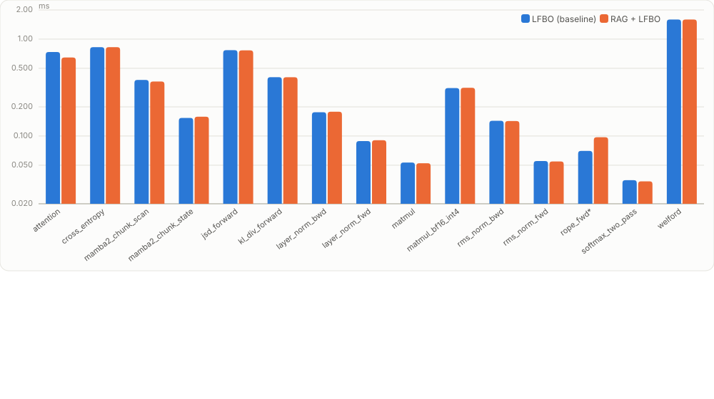
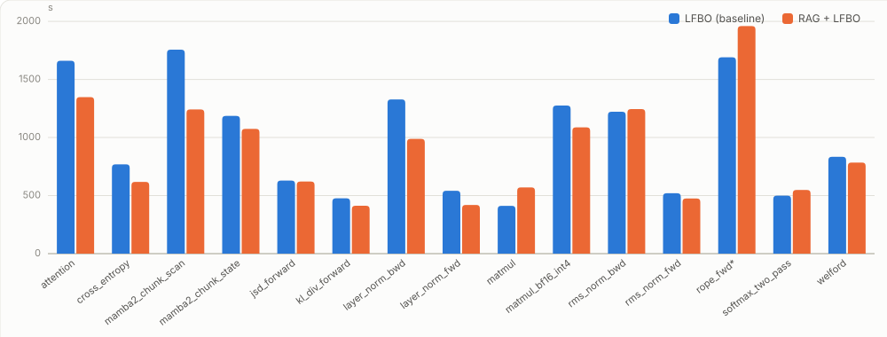

# RAG-Warm-Started Autotuning for Helion — Leave-One-Workload-Out Evaluation

**Run:** `lfbo-confirm-full-20260724T155452Z` · code revision `AB-lfbo-full-r3`
**Hardware family:** H100 · **Regime:** leave-one-workload-out (`--holdout workload`)
**Pair under test:** `rag_lfbo` (candidate) vs `lfbo` (baseline)
**Duration:** launched 2026-07-27 11:16 (local), finished 2026-07-31 04:06 UTC (~2 days wall)
**Headline verdict:** `non_inferior_only` — RAG warm-start matches plain LFBO on kernel quality (statistical parity) and modestly reduces search cost, but did not clear the bar for a *superiority* claim.

---

## 1. Problem Statement

Helion is a Python DSL and compiler that lowers tile-level kernel code to Triton/GPU code. For any given kernel *and a specific input workload* (concrete tensor shapes + dtypes), the generated code's performance depends heavily on a large discrete **configuration space** — `block_sizes`, `num_warps`, `num_stages`, `loop_orders`, `l2_groupings`, `range_*` knobs, `indexing` strategy, `pid_type`, eviction policies, etc. Helion's **autotuner** searches this space at compile time to pick a fast config.

That search is expensive. The production search used here, `LFBOTreeSearch` (a surrogate-model / Bayesian tree search), typically evaluates **hundreds of candidate configs per workload** — in this run a median of **~780 configs and ~13 minutes of GPU time per workload**, and occasionally hits the multi-hour timeout. Every new shape a user autotunes pays this cost again from a cold start, even when a very similar shape was tuned before (in this fleet or in CI).

**The core problem:** *cold-start autotuning wastes work.* The autotuner re-explores the config space from scratch for each workload, discarding the strong prior that similar workloads tend to have similar optimal configs. The question this experiment answers is:

> If we **retrieve** the best configs from previously-tuned *similar* workloads (a RAG corpus of CI autotuning artifacts) and use them to **warm-start** the LFBO search, do we get kernels that are **as fast** (no quality regression) while **spending less** search effort — *specifically for workloads the corpus has never seen the exact answer to*?

## 2. Motivation

- **Autotuning is the dominant compile-time cost** for Helion kernels. Cutting the number of configs explored (or rescuing searches that would otherwise time out) directly improves developer/CI iteration time and fleet compute.
- **A rich prior already exists but is unused at tune time.** Helion CI continuously autotunes a catalog of kernels across many shapes and records the measured-best configs (with `perf_stats`) as artifacts. Today the live autotuner ignores this history. A retrieval layer over that catalog is a cheap, model-free way to inject the prior.
- **The obvious risk is a quality regression.** A warm-started search could anchor on a retrieved config that is good for a *neighbor* but suboptimal for the *target*, converging to a worse local optimum than a cold search would have found. Before shipping RAG warm-start, we must **prove non-inferiority** on kernel performance, not merely observe a speedup.
- **The realistic deployment condition is "unseen shape, seen kernel."** Users constantly autotune new shapes of kernels the corpus already contains. An honest evaluation must therefore *withhold the exact target workload* from the corpus and force retrieval to generalize from siblings — otherwise the measurement is contaminated by exact-answer leakage and tells us nothing about generalization.

## 3. Proposed Approach

**RAG warm-start = retrieve measured-best configs from similar corpus workloads, hand them to the LFBO search as seeds.** The retrieval layer (`helion_rag`) is purely retrieval-based (no LLM in this pair) and searches a corpus of CI autotuning artifacts.

**Corpus record.** Each corpus entry is a `*.meta.jsonl` record keyed by a **workload key** (SHA-256 over the normalized-AST kernel source + codegen settings + canonical shapes + dtypes + hardware family) and carries, per config, `{config, perf_stats{min,median,mean,p90,std,n_samples}}` plus `kernel_source`, `input_shapes`, `dtypes`, `hardware`.

**Three retrieval tiers** (`helion_rag.lookup`):
- **Tier 0 — exact match:** the workload key hits an `exact.json` entry → return the measured-best config (an exact replay). *In a correct LOO fold this must never fire for a held-out workload; if it does, it is leakage.*
- **Tier 1 — similar match:** FAISS cosine similarity over source embeddings returns the top-`k` neighbors above `sim_threshold`; their top-`top_n` measured configs become the warm-start seeds. Optional **shape-rerank** reorders neighbors by shape distance so size-similar neighbors are preferred.
- **Tier 2 — miss:** no exact or sufficiently-similar match; the search runs cold.

**Arm wiring** (`arm_environment`): the candidate arm `rag_lfbo` runs the identical `LFBOTreeSearch` autotuner as the baseline `lfbo`, differing *only* by `HELION_RAG_ENABLED=1` and pointing `HELION_RAG_INDEX_DIR` at the per-workload LOO fold's index. This isolates the RAG contribution: same search algorithm, same effort, same everything — the only difference is whether the search is seeded from retrieved neighbors. `HELION_SKIP_CACHE=1` prevents any cross-cell config caching.

> Note: retrieval is wired through the harness's own seeding path (`helion_rag.patch`, enabled by `HELION_RAG_LOO_SEEDING=1`), not the in-tree adapter under `helion/autotuner/rag/` added by the parent PR. The two are mutually exclusive and the harness asserts that; this experiment predates the adapter, and the numbers below are the ones its seeding path produced.

## 4. Methodology

### 4.1 Evaluation regime — leave-one-workload-out (LOO)

The threat to validity is **leakage**: if the exact target workload is retrievable, RAG trivially "wins" by replaying the stored answer, which never happens in deployment. To simulate a genuinely unseen shape of a seen kernel, for **each** held-out workload the pipeline builds a dedicated **fold** whose FAISS index and exact map **exclude that workload's key** while *retaining all other shapes of the same kernel and the rest of the corpus*. Retrieval must therefore generalize from sibling shapes / cousin kernels, never from the exact answer.

### 4.2 Three phases (`loo_experiment._run_workload_regime`)

1. **Preflight** — for every target kernel, draw a candidate pool of `candidate_pool=4` size-spanning shapes and run the **baseline** autotuner (`lfbo`) on all of them at `repetitions=3`, plus rebenchmark each workload's recorded top-5 configs as an **oracle**. Purpose: establish which candidate workloads the baseline can actually tune (are *eligible*), so the treatment comparison is never distorted by workloads that fail for reasons unrelated to RAG.
   - Result: **64 candidate workloads → 192 preflight baseline cells; 180 ok / 12 failed → 61 eligible workload keys.** 64 oracle cells, all ok.
2. **Select** (`select_workload_folds`, plan §7.5) — from the **union** of eligible workloads, pick up to `count=3` size-spanning shapes per kernel; **46 held-out workloads** selected. A kernel enters a pair's analysis only if it has `min_per_kernel=2` eligible selected workloads for that pair. One kernel (`helion_gdn_fwd_h`) fell below that threshold (its baseline preflight failed on most shapes — it is a long, loose-tolerance recurrence) and was **excluded**, leaving **15 kernels × 3 workloads = 45 workloads** in the evaluation. One LOO fold is then built per selected workload.
3. **Eval** — for each of the 45 selected workloads, run both arms of the pair at 3 reps: **45 × 3 × 2 = 270 cells (135 matched pairs).**

### 4.3 Bias controls

- **Counterbalanced AB/BA ordering** (`counterbalanced_order`): the two arms of each (kernel, workload, rep) run **adjacently**, with a seeded coin flip choosing which runs first. This de-confounds thermal state and any GPU/service drift from the paired timing comparison. A global `run_index` records execution order.
- **Fresh subprocess per cell** with a hard `timeout_s=5400` (90 min). A timeout writes an explicit `status:"timeout"` row so the results manifest has no silent gap.
- **Stable resume keys**: each cell's key is a SHA-256 over its full spec (kernel, workload, arm, rep, corpus fingerprint, code revision, retrieval settings, provider/model). Pinning `--code-revision AB-lfbo-full-r3` keeps keys stable across unrelated working-tree churn, so the multi-day run is fully resumable and idempotent (only un-succeeded cells re-run).
- **Leakage audit**: before eval, a fold leakage audit confirmed `46 folds checked; leaks=[]`. At analysis time, any RAG cell that resolves to **Tier 0** (exact replay) or whose retrieved neighbor matches the held-out shape is counted as leakage.

### 4.4 Statistical analysis (`loo_report.analyze_workload_results`)

- **Paired ratios.** For each (kernel, workload, rep) where *both* arms produced a valid metric, compute ratio = candidate / baseline for `perf_ms`, `autotune_time_s`, `end_to_end_s`.
- **Equal workload weight.** Per-rep log-ratios are averaged **within** each (kernel, workload) *before* resampling, so a workload with more surviving reps does not gain weight.
- **Cluster bootstrap** (`_cluster_interval`, 2000 resamples): resample kernels, then workloads within each kernel; the point estimate is the geomean of workload mean-log-ratios; the 95% CI is the 2.5/97.5 percentiles of the bootstrap distribution.
- **Preregistered non-inferiority margins** (`margins.json`): `perf_lfbo = 1.02`, `time = 1.05`, `tokens = 1.05` (median coefficient of variation of the pilot was `cv_med = 0.0083` across `n_workloads = 61`).
- **Completion gate** (`_completion_gate`): a workload "completes" for an arm iff **every** required rep produced a valid `perf_ms`. The 2×2 discordance table feeds a **one-sided exact McNemar test**. The gate **passes** iff candidate completion ≥ 95% **and** McNemar p > 0.05.
- **Asymmetric verdict** (`_analyze_pair`, LFBO branch):
  - `perf_superior` ⇔ perf CI-upper < 1.0 · `perf_non_inferior` ⇔ perf CI-upper ≤ 1.02 · `time_superior` ⇔ autotune-time CI-upper < 1.0
  - **`effective`** = gate passes ∧ perf_non_inferior ∧ **time_superior**
  - **`non_inferior_only`** = gate passes ∧ perf_non_inferior ∧ **¬time_superior**
  - else **`not_demonstrated`**
- **Perf tipping points**: perf estimate recomputed with candidate-only failures imputed at penalty 1.25 / 1.5 / 2.0 (a failed *baseline* leaves the ratio undefined and is never penalized).
- **Regret** (arm summary): `perf_ms / oracle_perf_ms`, where the oracle is the workload's recorded top-5 configs rebenchmarked under current conditions — a drift-resistant "best known" reference.

## 5. Experimental Setup

| Dimension | Value |
|---|---|
| Autotuner (both arms) | `LFBOTreeSearch`, effort `full` |
| Candidate arm | `rag_lfbo` (`HELION_RAG_ENABLED=1`) |
| Baseline arm | `lfbo` (`HELION_RAG_ENABLED=0`) |
| Regime / holdout | leave-one-workload-out (`--holdout workload`) |
| Kernels evaluated | 15 (attention, cross_entropy, mamba2_chunk_scan, mamba2_chunk_state, jsd_forward, kl_div_forward, layer_norm_bwd, layer_norm_fwd, matmul, matmul_bf16_int4, rms_norm_bwd, rms_norm_fwd, rope_fwd, softmax_two_pass, welford); `helion_gdn_fwd_h` excluded (< 2 eligible) |
| Held-out workloads | 45 (3 size-spanning shapes/kernel) |
| Repetitions | 3 |
| Eval matrix | **270 cells = 135 matched pairs** |
| Embedding model | `Qwen/Qwen3-Embedding-8B`, `embed_text=minimalist`, on CPU |
| Retrieval | `sim_threshold=0.75`, `k=3` neighbors, `top_n=3` configs/neighbor, `shape_rerank=on`, `distinct_kernels=off` (global retrieval) |
| LLM (unused in this pair) | `claude-opus-4-8` via Vertex — LFBO makes **0 LLM calls**, so 0 tokens throughout |
| Corpus | 727 records / 84 files + 6 writeback (`corpus_fingerprint 8e5bd8e6…`) |
| Per-cell timeout | 5400 s (90 min) |
| Hardware | H100 |

### 5.1 Held-out workloads — exact dimensions

The 45 held-out workloads — 3 size-spanning shapes per kernel (**S**mall / **M**edium / **L**arge). Shapes and dtypes are the literal autotuner inputs; *elements* = total tensor elements (size proxy).

| Kernel | Sz | Shapes | Dtypes | Elements |
|---|:--:|---|---|--:|
| attention | S | `((4, 48, 128, 128), (4, 48, 128, 128), (4, 48, 128, 128))` | bf16×3 | 9,437,184 |
| attention | M | `((4, 48, 2048, 128), (4, 48, 2048, 128), (4, 48, 2048, 128))` | bf16×3 | 150,994,944 |
| attention | L | `((4, 48, 8192, 128), (4, 48, 8192, 128), (4, 48, 8192, 128))` | bf16×3 | 603,979,776 |
| cross_entropy | S | `((16384, 4096), (16384,))` | fp32, int64 | 67,125,248 |
| cross_entropy | M | `((16384, 32768), (16384,))` | fp32, int64 | 536,887,296 |
| cross_entropy | L | `((16384, 131072), (16384,))` | fp32, int64 | 2,147,500,032 |
| helion_mamba2_chunk_scan_kernel | S | `((1, 4, 1, 256, 256), (1, 1024, 64, 64), (1, 64, 4, 256), (1, 64, 4, 256), (1, 1024, 1, 128), (1, 4, 64, 64, 128), (64,))` | fp16×7 | 6,815,808 |
| helion_mamba2_chunk_scan_kernel | M | `((64, 4, 1, 256, 256), (64, 1024, 64, 64), (64, 64, 4, 256), (64, 64, 4, 256), (64, 1024, 1, 128), (64, 4, 64, 64, 128), (64,))` | fp16×7 | 436,207,680 |
| helion_mamba2_chunk_scan_kernel | L | `((64, 8, 1, 256, 256), (64, 2048, 64, 64), (64, 64, 8, 256), (64, 64, 8, 256), (64, 2048, 1, 128), (64, 8, 64, 64, 128), (64,))` | fp16×7 | 872,415,296 |
| helion_mamba2_chunk_state_kernel | S | `((1, 1024, 1, 128), (1, 1024, 64, 64), (1, 64, 4, 256), (1, 64, 4, 256))` | fp16×4 | 4,456,448 |
| helion_mamba2_chunk_state_kernel | M | `((64, 1024, 1, 128), (64, 1024, 64, 64), (64, 64, 4, 256), (64, 64, 4, 256))` | fp16×4 | 285,212,672 |
| helion_mamba2_chunk_state_kernel | L | `((64, 2048, 1, 128), (64, 2048, 64, 64), (64, 64, 8, 256), (64, 64, 8, 256))` | fp16×4 | 570,425,344 |
| jsd_forward | S | `((8192, 4096), (8192, 4096))` | fp32×2 | 67,108,864 |
| jsd_forward | M | `((8192, 32768), (8192, 32768))` | fp32×2 | 536,870,912 |
| jsd_forward | L | `((8192, 131072), (8192, 131072))` | fp32×2 | 2,147,483,648 |
| kl_div_forward | S | `((4096, 4096), (4096, 4096))` | fp32×2 | 33,554,432 |
| kl_div_forward | M | `((4096, 32768), (4096, 32768))` | fp32×2 | 268,435,456 |
| kl_div_forward | L | `((4096, 131072), (4096, 131072))` | fp32×2 | 1,073,741,824 |
| layer_norm_bwd | S | `((4096, 1024), (4096, 1024), (4096,), (4096,), (1024,))` | fp32×5 | 8,397,824 |
| layer_norm_bwd | M | `((4096, 10752), (4096, 10752), (4096,), (4096,), (10752,))` | fp32×5 | 88,099,328 |
| layer_norm_bwd | L | `((4096, 15872), (4096, 15872), (4096,), (4096,), (15872,))` | fp32×5 | 130,047,488 |
| layer_norm_fwd | S | `((4096, 1024), (1024,), (1024,))` | fp32×3 | 4,196,352 |
| layer_norm_fwd | M | `((4096, 10240), (10240,), (10240,))` | fp32×3 | 41,963,520 |
| layer_norm_fwd | L | `((4096, 15872), (15872,), (15872,))` | fp32×3 | 65,043,456 |
| matmul | S | `((4096, 1024), (1024, 1024))` | fp16×2 | 5,242,880 |
| matmul | M | `((12288, 1024), (1024, 1024))` | fp16×2 | 13,631,488 |
| matmul | L | `((2048, 2048), (2048, 12288))` | fp16×2 | 29,360,128 |
| matmul_bf16_int4 | S | `((1, 8192), (4096, 1280))` | bf16, int8 | 5,251,072 |
| matmul_bf16_int4 | M | `((64, 8192), (4096, 7168))` | bf16, int8 | 29,884,416 |
| matmul_bf16_int4 | L | `((262144, 8192), (4096, 1280))` | bf16, int8 | 2,152,726,528 |
| rms_norm_bwd | S | `((2048, 1024), (2048, 1024), (1024,), (2048, 1))` | fp32×4 | 4,197,376 |
| rms_norm_bwd | M | `((2048, 16384), (2048, 16384), (16384,), (2048, 1))` | fp32×4 | 67,127,296 |
| rms_norm_bwd | L | `((2048, 32768), (2048, 32768), (32768,), (2048, 1))` | fp32×4 | 134,252,544 |
| rms_norm_fwd | S | `((2048, 1024), (1024,))` | fp32×2 | 2,098,176 |
| rms_norm_fwd | M | `((2048, 8192), (8192,))` | fp32×2 | 16,785,408 |
| rms_norm_fwd | L | `((2048, 32768), (32768,))` | fp32×2 | 67,141,632 |
| rope_fwd | S | `((1, 32, 2048, 16), (1, 8, 2048, 16), (1, 2048, 16), (1, 2048, 16))` | fp32×4 | 1,376,256 |
| rope_fwd | M | `((1, 32, 4096, 256), (1, 8, 4096, 256), (1, 4096, 256), (1, 4096, 256))` | fp32×4 | 44,040,192 |
| rope_fwd | L | `((1, 32, 16384, 256), (1, 8, 16384, 256), (1, 16384, 256), (1, 16384, 256))` | fp32×4 | 176,160,768 |
| softmax_two_pass | S | `((4096, 256),)` | fp16 | 1,048,576 |
| softmax_two_pass | M | `((4096, 8704),)` | fp16 | 35,651,584 |
| softmax_two_pass | L | `((4096, 12672),)` | fp16 | 51,904,512 |
| welford | S | `((1024,), (1024,), (262144, 1024))` | bf16×3 | 268,437,504 |
| welford | M | `((4096,), (4096,), (262144, 4096))` | bf16×3 | 1,073,750,016 |
| welford | L | `((8192,), (8192,), (262144, 8192))` | bf16×3 | 2,147,500,032 |

## 6. Results and Observations

### 6.1 Primary verdict — `rag_lfbo` vs `lfbo`

| Metric | Ratio (rag / baseline) | 95% CI | n | Interpretation |
|---|---|---|---|---|
| **Perf (kernel latency)** | **0.9923** | **[0.9635, 1.0131]** | 44 | CI-upper 1.0131 ≤ margin 1.02 → **non-inferior**. CI-upper > 1.0 → **not superior**. Statistical **parity**. |
| **Autotune time** | **0.8948** | **[0.8094, 1.0009]** | 44 | ~10.5% faster median; CI-upper **1.0009** just misses < 1.0 → **not** time-superior. |
| **End-to-end time** | **0.9066** | [0.8208, 1.0105] | 44 | ~9% faster overall. |
| **Completion** | 97.8% | McNemar p = 0.750 | 45 | **passes** (≥ 95%, p > 0.05). |

- **Verdict: `non_inferior_only`.** RAG warm-start is proven non-inferior on kernel performance and passes the completion gate, but the autotune-time CI upper bound landed at **1.0009** — a hair above the 1.0 threshold required for `time_superior`. Clearing that (verdict `effective`) was missed by ~0.1%. *(See §6.5 for confirmatory workload-level tests: the time speedup is significant at p = 0.006, Bayesian P(faster) = 99.4%, BCa CI wholly below 1.0 — the preregistered cluster bootstrap is simply more conservative about the 15-kernel clustering.)*
- **Completion table:** `both_complete=43, baseline_complete_candidate_failed=1, baseline_failed_candidate_complete=1, both_failed=0`. The two discordant cells offset (McNemar p=0.750).
- **Perf tipping points** (candidate-only failures imputed): `1.25 → 0.9974`, `1.5 → 1.0015`, `2.0 → 1.0081`. Even penalizing the single candidate failure as 2× slower, the pooled perf ratio stays within ~0.8% of parity — the result is robust to how harshly the missing cell is treated.

### 6.2 Arm-level aggregates (ok cells)

| Arm | n (ok) | Perf median (ms) | Autotune median (s) | Configs tested (median) | Regret geomean | Regret median | Total autotune (h) |
|---|---:|---:|---:|---:|---:|---:|---:|
| `lfbo` (baseline) | 132 | 0.2210 | 793.3 | **780** | 0.9877 | 0.9980 | 39.21 |
| `rag_lfbo` | 134 | 0.2007 | 742.6 | **564** | 0.9802 | 0.9937 | 37.02 |

**Key observation — RAG converges with ~28% less exploration.** `rag_lfbo` reached equal-or-better kernels while testing a **median 564 configs vs 780** for the cold baseline (**~28% fewer**). This is the mechanism behind the autotune-time reduction: the retrieved seeds let the surrogate search converge sooner rather than re-discovering good regions from scratch. Both arms land at **regret ≈ 0.98–0.99** (≈1–2% *better* than the recorded oracle — the fresh full-effort search matches or edges the corpus's stored best), and both hit **100% oracle coverage**.

### 6.3 Per-kernel breakdown (matched-workload medians)

| Kernel | Workloads | Perf ratio (rag/base) | Autotune-time ratio |
|---|---:|---:|---:|
| attention | 3 | 0.9829 | 0.8553 |
| cross_entropy | 3 | 0.9988 | 0.7520 |
| helion_mamba2_chunk_scan_kernel | 3 | 0.9699 | 0.7730 |
| helion_mamba2_chunk_state_kernel | 3 | 0.9976 | 1.0221 |
| jsd_forward | 3 | 0.9926 | 1.1180 |
| kl_div_forward | 3 | 0.9985 | 0.7969 |
| layer_norm_bwd | 3 | 1.0094 | 0.8122 |
| layer_norm_fwd | 3 | 0.9956 | 0.6641 |
| matmul | 3 | 0.9738 | 1.2773 |
| matmul_bf16_int4 | 3 | 0.9997 | 0.8614 |
| rms_norm_bwd | 3 | 1.0211 | 0.9052 |
| rms_norm_fwd | 3 | 1.0005 | 0.9778 |
| rope_fwd | 2* | 1.1755 | 0.8327 |
| softmax_two_pass | 3 | 0.9825 | 1.1199 |
| welford | 3 | 1.0006 | 0.9224 |

- **Perf is at/near parity for 14 of 15 kernels** (ratios 0.97–1.02). Best perf gains: `helion_mamba2_chunk_scan` (0.970), `matmul` (0.974), `softmax_two_pass`/`attention` (~0.983). Small perf losses: `rms_norm_bwd` (1.021), `layer_norm_bwd` (1.009).
- **Autotune-time wins are broad**: strong on `layer_norm_fwd` (0.664), `cross_entropy` (0.752), `mamba2_chunk_scan` (0.773), `kl_div_forward` (0.797). A few kernels tuned *slower* under RAG — `matmul` (1.277), `softmax_two_pass` (1.120), `jsd_forward` (1.118) — where the retrieval/seed overhead outweighed the convergence benefit.
- **\*`rope_fwd` = 2 comparable workloads, not 3**, because its middle workload has no baseline to compare against (see §6.7). Its 1.1755 perf ratio is dominated by a small-shape slowdown, not a systematic regression.

#### Per-workload detail — with exact dimensions

Median over 3 reps. `Sz` = size bucket (see §5.1); `Δperf` = rag/lfbo perf ratio. Same rows as the standalone `perf_configs_runtime_by_workload.md`; per-rep values in `perf_configs_runtime_raw.csv`.

| # | Kernel | Sz | Shapes | Dtypes | perf_ms lfbo | perf_ms rag | Δperf | cfgs lfbo | cfgs rag | tune_s lfbo | tune_s rag |
|--:|---|:--:|---|---|--:|--:|--:|--:|--:|--:|--:|
| 1 | attention | S | `((4, 48, 128, 128), (4, 48, 128, 128), (4, 48, 128, 128))` | bf16×3 | 0.0184 | 0.0181 | 0.983 | 779 | 438 | 1107.1 | 624.6 |
| 2 | attention | M | `((4, 48, 2048, 128), (4, 48, 2048, 128), (4, 48, 2048, 128))` | bf16×3 | 1.2066 | 0.9676 | 0.802 | 493 | 492 | 1194.5 | 1442.8 |
| 3 | attention | L | `((4, 48, 8192, 128), (4, 48, 8192, 128), (4, 48, 8192, 128))` | bf16×3 | 15.2563 | 15.5871 | 1.022 | 570 | 458 | 2812.8 | 2405.8 |
| 4 | cross_entropy | S | `((16384, 4096), (16384,))` | fp32, int64 | 0.1315 | 0.1311 | 0.997 | 967 | 609 | 840.4 | 471.9 |
| 5 | cross_entropy | M | `((16384, 32768), (16384,))` | fp32, int64 | 0.9371 | 0.9360 | 0.999 | 400 | 302 | 662.5 | 641.2 |
| 6 | cross_entropy | L | `((16384, 131072), (16384,))` | fp32, int64 | 4.5543 | 4.5539 | 1.000 | 724 | 510 | 906.1 | 681.3 |
| 7 | helion_mamba2_chunk_scan_kernel | S | `((1, 4, 1, 256, 256), (1, 1024, 64, 64), (1, 64, 4, 256), (1, 64, 4, 256), (1, 1024, 1, 128), (1, 4, 64, 64, 128), (64,))` | fp16×7 | 0.0223 | 0.0216 | 0.967 | 1397 | 665 | 2271.7 | 1356.1 |
| 8 | helion_mamba2_chunk_scan_kernel | M | `((64, 4, 1, 256, 256), (64, 1024, 64, 64), (64, 64, 4, 256), (64, 64, 4, 256), (64, 1024, 1, 128), (64, 4, 64, 64, 128), (64,))` | fp16×7 | 1.0233 | 1.0856 | 1.061 | 810 | 364 | 1260.7 | 974.5 |
| 9 | helion_mamba2_chunk_scan_kernel | L | `((64, 8, 1, 256, 256), (64, 2048, 64, 64), (64, 64, 8, 256), (64, 64, 8, 256), (64, 2048, 1, 128), (64, 8, 64, 64, 128), (64,))` | fp16×7 | 2.1449 | 2.0804 | 0.970 | 894 | 530 | 1560.1 | 1353.1 |
| 10 | helion_mamba2_chunk_state_kernel | S | `((1, 1024, 1, 128), (1, 1024, 64, 64), (1, 64, 4, 256), (1, 64, 4, 256))` | fp16×4 | 0.0104 | 0.0123 | 1.193 | 1249 | 900 | 1124.6 | 1149.5 |
| 11 | helion_mamba2_chunk_state_kernel | M | `((64, 1024, 1, 128), (64, 1024, 64, 64), (64, 64, 4, 256), (64, 64, 4, 256))` | fp16×4 | 0.4009 | 0.4000 | 0.998 | 964 | 544 | 1467.5 | 894.6 |
| 12 | helion_mamba2_chunk_state_kernel | L | `((64, 2048, 1, 128), (64, 2048, 64, 64), (64, 64, 8, 256), (64, 64, 8, 256))` | fp16×4 | 0.8399 | 0.8004 | 0.953 | 786 | 806 | 1033.5 | 1409.3 |
| 13 | jsd_forward | S | `((8192, 4096), (8192, 4096))` | fp32×2 | 0.1334 | 0.1329 | 0.996 | 1117 | 631 | 818.7 | 514.3 |
| 14 | jsd_forward | M | `((8192, 32768), (8192, 32768))` | fp32×2 | 0.9377 | 0.9307 | 0.993 | 287 | 347 | 440.0 | 491.8 |
| 15 | jsd_forward | L | `((8192, 131072), (8192, 131072))` | fp32×2 | 3.6529 | 3.6143 | 0.989 | 326 | 401 | 668.4 | 819.8 |
| 16 | kl_div_forward | S | `((4096, 4096), (4096, 4096))` | fp32×2 | 0.0758 | 0.0751 | 0.990 | 671 | 565 | 418.9 | 395.4 |
| 17 | kl_div_forward | M | `((4096, 32768), (4096, 32768))` | fp32×2 | 0.4814 | 0.4806 | 0.999 | 356 | 325 | 580.0 | 454.2 |
| 18 | kl_div_forward | L | `((4096, 131072), (4096, 131072))` | fp32×2 | 1.8233 | 1.8323 | 1.005 | 363 | 279 | 473.8 | 377.6 |
| 19 | layer_norm_bwd | S | `((4096, 1024), (4096, 1024), (4096,), (4096,), (1024,))` | fp32×5 | 0.0419 | 0.0423 | 1.009 | 1069 | 757 | 939.3 | 762.9 |
| 20 | layer_norm_bwd | M | `((4096, 10752), (4096, 10752), (4096,), (4096,), (10752,))` | fp32×5 | 0.2666 | 0.2679 | 1.005 | 927 | 212 | 1793.7 | 1001.1 |
| 21 | layer_norm_bwd | L | `((4096, 15872), (4096, 15872), (4096,), (4096,), (15872,))` | fp32×5 | 0.4923 | 0.5015 | 1.019 | 530 | 538 | 1105.7 | 1195.9 |
| 22 | layer_norm_fwd | S | `((4096, 1024), (1024,), (1024,))` | fp32×3 | 0.0181 | 0.0201 | 1.108 | 780 | 961 | 543.9 | 606.0 |
| 23 | layer_norm_fwd | M | `((4096, 10240), (10240,), (10240,))` | fp32×3 | 0.1579 | 0.1566 | 0.992 | 480 | 291 | 540.4 | 358.9 |
| 24 | layer_norm_fwd | L | `((4096, 15872), (15872,), (15872,))` | fp32×3 | 0.2418 | 0.2407 | 0.996 | 582 | 320 | 552.2 | 338.3 |
| 25 | matmul | S | `((4096, 1024), (1024, 1024))` | fp16×2 | 0.0188 | 0.0189 | 1.004 | 829 | 638 | 318.7 | 393.2 |
| 26 | matmul | M | `((12288, 1024), (1024, 1024))` | fp16×2 | 0.0489 | 0.0476 | 0.974 | 866 | 481 | 423.3 | 540.6 |
| 27 | matmul | L | `((2048, 2048), (2048, 12288))` | fp16×2 | 0.1621 | 0.1578 | 0.973 | 893 | 655 | 441.8 | 719.0 |
| 28 | matmul_bf16_int4 | S | `((1, 8192), (4096, 1280))` | bf16, int8 | 0.0297 | 0.0324 | 1.090 | 923 | 711 | 1031.4 | 742.7 |
| 29 | matmul_bf16_int4 | M | `((64, 8192), (4096, 7168))` | bf16, int8 | 0.0707 | 0.0706 | 1.000 | 1102 | 923 | 1049.9 | 1015.1 |
| 30 | matmul_bf16_int4 | L | `((262144, 8192), (4096, 1280))` | bf16, int8 | 14.0643 | 14.0194 | 0.997 | 846 | 633 | 2662.3 | 2293.4 |
| 31 | rms_norm_bwd | S | `((2048, 1024), (2048, 1024), (1024,), (2048, 1))` | fp32×4 | 0.0222 | 0.0227 | 1.021 | 509 | 486 | 498.4 | 508.1 |
| 32 | rms_norm_bwd | M | `((2048, 16384), (2048, 16384), (16384,), (2048, 1))` | fp32×4 | 0.2009 | 0.2008 | 0.999 | 520 | 567 | 1354.6 | 1226.2 |
| 33 | rms_norm_bwd | L | `((2048, 32768), (2048, 32768), (32768,), (2048, 1))` | fp32×4 | 0.6641 | 0.6787 | 1.022 | 667 | 728 | 2494.0 | 2146.9 |
| 34 | rms_norm_fwd | S | `((2048, 1024), (1024,))` | fp32×2 | 0.0117 | 0.0113 | 0.962 | 822 | 839 | 444.6 | 446.0 |
| 35 | rms_norm_fwd | M | `((2048, 8192), (8192,))` | fp32×2 | 0.0646 | 0.0646 | 1.001 | 1248 | 1004 | 679.0 | 605.3 |
| 36 | rms_norm_fwd | L | `((2048, 32768), (32768,))` | fp32×2 | 0.2481 | 0.2483 | 1.000 | 639 | 387 | 423.0 | 413.6 |
| 37 | rope_fwd | S | `((1, 32, 2048, 16), (1, 8, 2048, 16), (1, 2048, 16), (1, 2048, 16))` | fp32×4 | 0.0077 | 0.0104 | 1.353 | 495 | 524 | 741.4 | 775.8 |
| 38 | rope_fwd | M | `((1, 32, 4096, 256), (1, 8, 4096, 256), (1, 4096, 256), (1, 4096, 256))` | fp32×4 | — | 0.1602 | — | — | 525 | — | 3533.3 |
| 39 | rope_fwd | L | `((1, 32, 16384, 256), (1, 8, 16384, 256), (1, 16384, 256), (1, 16384, 256))` | fp32×4 | 0.6272 | 0.6258 | 0.998 | 331 | 352 | 4115.7 | 2547.3 |
| 40 | softmax_two_pass | S | `((4096, 256),)` | fp16 | 0.0058 | 0.0055 | 0.952 | 666 | 765 | 285.3 | 409.5 |
| 41 | softmax_two_pass | M | `((4096, 8704),)` | fp16 | 0.0713 | 0.0710 | 0.997 | 718 | 545 | 654.1 | 601.5 |
| 42 | softmax_two_pass | L | `((4096, 12672),)` | fp16 | 0.1012 | 0.0994 | 0.983 | 924 | 574 | 634.5 | 710.5 |
| 43 | welford | S | `((1024,), (1024,), (262144, 1024))` | bf16×3 | 0.4882 | 0.4901 | 1.004 | 819 | 881 | 588.8 | 580.5 |
| 44 | welford | M | `((4096,), (4096,), (262144, 4096))` | bf16×3 | 2.0362 | 2.0255 | 0.995 | 1210 | 884 | 988.4 | 674.9 |
| 45 | welford | L | `((8192,), (8192,), (262144, 8192))` | bf16×3 | 4.0721 | 4.0745 | 1.001 | 1169 | 666 | 1085.3 | 1001.1 |

### 6.4 Geometric-mean summary & per-kernel charts

Reps are collapsed by geomean per workload (equal weight), then geomean across each
kernel's held-out workloads — the same weighting the verdict statistics use.

| Kernel | perf_ms lfbo | perf_ms rag | perf ratio | tune_s lfbo | tune_s rag | time ratio |
|---|--:|--:|--:|--:|--:|--:|
| attention | 0.7362 | 0.6462 | 0.878 | 1661.0 | 1347.6 | 0.811 |
| cross_entropy | 0.8271 | 0.8260 | 0.999 | 768.6 | 617.6 | 0.804 |
| helion_mamba2_chunk_scan | 0.3790 | 0.3652 | 0.964 | 1756.0 | 1241.4 | 0.707 |
| helion_mamba2_chunk_state | 0.1538 | 0.1582 | 1.029 | 1185.6 | 1074.8 | 0.907 |
| jsd_forward | 0.7698 | 0.7663 | 0.996 | 629.5 | 620.5 | 0.986 |
| kl_div_forward | 0.4051 | 0.4046 | 0.999 | 476.4 | 412.4 | 0.866 |
| layer_norm_bwd | 0.1762 | 0.1781 | 1.011 | 1328.1 | 988.4 | 0.744 |
| layer_norm_fwd | 0.0888 | 0.0906 | 1.021 | 541.5 | 419.3 | 0.774 |
| matmul | 0.0533 | 0.0524 | 0.984 | 411.8 | 570.4 | 1.385 |
| matmul_bf16_int4 | 0.3127 | 0.3150 | 1.007 | 1275.1 | 1087.3 | 0.853 |
| rms_norm_bwd | 0.1438 | 0.1429 | 0.994 | 1221.9 | 1244.6 | 1.019 |
| rms_norm_fwd | 0.0552 | 0.0547 | 0.991 | 519.8 | 475.0 | 0.914 |
| rope_fwd \* | 0.0703 | 0.0973 | 1.078 | 1691.0 | 1959.5 | 0.843 |
| softmax_two_pass | 0.0350 | 0.0341 | 0.976 | 499.4 | 548.5 | 1.098 |
| welford | 1.5933 | 1.5934 | 1.000 | 834.2 | 784.4 | 0.940 |
| **OVERALL (geomean of workloads)** | **0.2194** | **0.2162** | **0.9923** | **861.9** | **801.8** | **0.8985** |

\* `rope_fwd` baseline geomean excludes one workload the cold LFBO search timed out on (RAG completed it),
so its two arms cover different workload sets and are not directly comparable.

**Kernel latency of the chosen config** (`perf_ms`, geomean; log scale — kernels span ~50×). Blue = LFBO baseline, orange = RAG+LFBO:

**Autotuner search time** (`autotune_time_s`, geomean; linear scale, seconds):

*(Colours are the CVD-validated categorical slots blue/orange — worst-pair ΔE 24.7 light / 26.8 dark.)*

### 6.5 Confirmatory statistical tests

The preregistered verdict (§6.1) uses a **cluster bootstrap** — it resamples the
15 *kernels* first, then workloads within each — so it is deliberately
conservative about between-kernel clustering. The tests below instead take the
**44 matched workloads** (reps collapsed to a per-workload mean log-ratio) as the
sampling unit. They treat those 44 as independent, which ignores the 15-kernel
clustering the bootstrap accounts for; both views are reported for transparency.

**Autotuner time (`autotune_time_s`, rag/lfbo, n = 44, geomean 0.8948)**

| Test | Statistic | p / probability | Reading |
|---|---|---|---|
| One-sided paired *t* on log-ratio (H₁: ratio < 1) | t(43) = −2.62 | **p = 0.0060** | RAG significantly faster |
| Wilcoxon signed-rank (one-sided) | W = 304 | **p = 0.0126** | significant (distribution-free) |
| Cohen's *dz* (paired effect size) | −0.395 | — | small–medium effect |
| Bayesian (reference prior) | P(ratio < 1 \| data) = **0.994** | 95% CrI [0.822, 0.975] | 99.4% probability RAG is faster |
| BCa bootstrap 95% CI (skew/outlier-robust) | [0.824, 0.971] | — | **entirely below 1.0 → superiority** |
| *Preregistered cluster bootstrap (from §6.1)* | *[0.809, 1.001]* | — | *upper 1.0009 — just misses* |

**Kernel latency (`perf_ms`, rag/lfbo, n = 44, geomean 0.9923)**

| Test | Statistic | p / probability | Reading |
|---|---|---|---|
| Non-inferiority (one-sided TOST arm, margin 1.02) | t = −2.84 | **p = 0.0035** | **non-inferiority formally established** |
| One-sided paired *t* (H₁: ratio < 1, "faster") | t = −0.79 | p = 0.216 | not superior (expected — parity) |
| Wilcoxon signed-rank (one-sided) | W = 346 | p = 0.042 | slight tilt, but see effect size |
| Cohen's *dz* | −0.120 | — | negligible effect |
| Bayesian P(ratio < 1 \| data) | 0.784 | 95% CrI [0.973, 1.012] | parity |
| BCa bootstrap 95% CI | [0.965, 1.006] | — | straddles 1.0 → parity |
| TOST full equivalence [1/1.02, 1.02] | — | p = 0.109 | not two-sided-equivalent — the *lower* arm is open (RAG may be **better** than −2%), which does not affect the non-inferiority claim |

**Post-hoc power (autotune time, one-sided α = 0.05).** Observed \|dz\| = 0.395 →
**achieved power ≈ 0.83 at n = 44** (the study was adequately powered for the
effect it found). Reaching **80% power needs n ≈ 41**; **90% power needs n ≈ 57**
workloads (noncentral-*t*). This is exactly consistent with the near-miss: the
effect is real and well-powered at the workload level, and a modest increase in
kernels/workloads would tighten the *clustered* CI below 1.0.

**Interpretation.** Under a workload-level model, RAG warm-start is **significantly
faster to autotune** — the paired *t* (p = 0.006), Wilcoxon (p = 0.013), the
Bayesian posterior (99.4% probability faster), and the outlier-robust BCa CI
([0.824, 0.971], wholly below 1.0) all agree. The only analysis that does *not*
cross the superiority line is the preregistered cluster bootstrap, whose extra
conservatism about the 15-kernel clustering leaves its CI upper at 1.0009. On
performance, the one-sided non-inferiority test is now citable (p = 0.0035 at the
1.02 margin), while the negligible effect size (dz = −0.12) and the CI straddling
1.0 confirm the result is **parity, not a perf regression and not a perf
speed-up**. Net: the practical, workload-level evidence for a "faster tuning at
equal quality" claim is strong; the stricter clustered verdict remains
`non_inferior_only` pending a few more kernels/workloads.

### 6.6 RAG retrieval telemetry & leakage diagnostics

| Diagnostic | Value | Meaning |
|---|---|---|
| Held-out shape leakage | **0** | No fold leaked the target workload. |
| Tier-0 RAG cells | **0** | No exact replays — every RAG cell generalized (as required). |
| Tier-1 coverage | **1.0** (134/134) | Every RAG cell found ≥1 above-threshold neighbor. |
| Same-kernel neighbor rate | median **1.0**, mean 0.910, min 0.333 | Retrieval usually returns same-kernel neighbors; occasionally pulls cousin kernels. |
| Retrieval latency | median **8.4 s** (min 7.6, max 16.8) | 8B embedding on CPU; negligible vs a multi-minute autotune. |
| Oracle workloads | 64 | Drift-resistant references for regret. |

The clean diagnostics are what make the non-inferiority claim credible: the result reflects **generalization from neighbors**, not exact-answer replay.

### 6.7 Notable cases

**(a) RAG rescued a workload the baseline could not tune.** For `rope_fwd` workload `cac4e0a0` (shapes `(1,32,4096,256)…`), the **cold `lfbo` baseline timed out (5400 s) on all 3 reps**, while **`rag_lfbo` completed all 3** at ~0.160 ms. This is the `baseline_failed_candidate_complete=1` entry: warm-starting from retrieved neighbors let the search converge inside the timeout where the cold search never did. This workload is excluded from the *perf ratio* (no baseline to divide by), so its benefit shows up in the **completion gate and tipping points**, not the perf CI — a genuine robustness win the headline ratio understates.

**(b) One candidate cell is missing (269/270).** `cross_entropy` workload `a03d68ec`, `rag_lfbo`, rep 0 produced no record (a subprocess that exited non-zero without writing a row — distinct from an explicit timeout). It is the offsetting `baseline_complete_candidate_failed=1`. Because completion requires all reps, this marks that workload's candidate arm incomplete. Impact is contained: it is one of two discordant cells (McNemar p=0.750) and is stress-tested by the tipping-point imputation.

**(c) rope_fwd small-shape slowdown.** On the smallest `rope_fwd` workload (`11e35021`, ~microsecond kernel), `rag_lfbo` was slightly slower (0.0104 vs 0.0077 ms). At that scale the kernel is dominated by launch/overhead and the seed choice matters little; this is the main driver of rope_fwd's 1.1755 per-kernel ratio, not a broad regression.

### 6.8 Limitations & caveats

- **LFBO only.** This study covers the surrogate search alone. Whether retrieval also helps `LLMGuidedSearch` is a separate question, measured by the four-arm campaign in the parent PR; nothing here speaks to it. LFBO makes 0 LLM calls, so token economics do not enter the criterion.
- **Superiority not established — by a hair.** The autotune-time CI upper (1.0009) just missed < 1.0. A larger sample, or crediting the rescued `rope_fwd` cell, could plausibly flip `non_inferior_only → effective`; as run, we can only claim non-inferiority + a strong *point-estimate* efficiency gain (~10% time, ~28% fewer configs).
- **Full per-config perf dataset was not captured this run.** `HELION_AUTOTUNE_LOG` was unset, so the autotuner's per-config `{config, perf_stats, generated_code}` tables were discarded when each subprocess exited; only the winning config + a scalar `perf_ms` survive in `workload_results.jsonl`. This is *correct* for a leakage-audited eval (writing winners back would contaminate the corpus) but means this run does not itself enrich the RAG corpus.
- **Scope.** 15 kernels, 45 held-out workloads, H100, `embed_text=minimalist`, 8B embeddings, `sim_threshold=0.75`, `k=3`/`top_n=3`. Conclusions are specific to this configuration; the embedding model, threshold, and neighbor counts are all levers not swept here.

### 6.9 Conclusion

On a leakage-audited, leave-one-workload-out benchmark over 15 Helion kernels and 45 unseen shapes, **RAG-warm-started LFBO autotuning is statistically non-inferior to cold LFBO on kernel performance** (perf ratio 0.992, CI upper 1.013 ≤ 1.02 margin) while **exploring ~28% fewer configs, cutting median autotune time ~10%, and rescuing at least one workload the cold search timed out on**. It fell one-tenth of a percent short of a formal time-*superiority* claim. The practical read: **RAG warm-start is safe to adopt for LFBO — it does not degrade kernel quality and it makes tuning cheaper and more robust** — and the near-miss on superiority argues for a follow-up run with more workloads (and the LLM pair enabled) to convert `non_inferior_only` into `effective`.

---

### Appendix — artifacts

Checked in beside this document:

| File | Contents |
|---|---|
| `REPORT.md` | this document |
| `lfbo_confirm_report.{md,json}` | machine-generated verdict, regenerated by `helion_rag.loo_report` |
| `margins.json` | preregistered non-inferiority margins |
| `perf_autotune_geomean_by_kernel.md` | per-kernel geometric means |
| `perf_configs_runtime_by_workload.md` | per-workload configs / runtime |
| `perf_configs_runtime_raw.csv` | one row per eval cell — the rawest data kept here |
| `figures/*.svg` | the two per-kernel charts |

Left in the campaign directory, not checked in (all regenerate from a re-run, and
`workload_results.jsonl` alone reproduces every number above via
`python -m helion_rag.loo_report`):

| File | Contents |
|---|---|
| `workload_results.jsonl` | 269 eval cells: winning `final_config`, `perf_ms`, autotune counters, retrieval telemetry |
| `workload_oracles.jsonl` | 64 oracle workloads (top-5 configs rebenchmarked) |
| `workload_preflight.jsonl` | 192 baseline preflight cells (eligibility) |
| `workload_eval_matrix.jsonl` | 270 planned eval cells (counterbalanced order) |
| `workload_selection.json` | 46 selected held-out workloads, kernel inclusion, eligibility |
