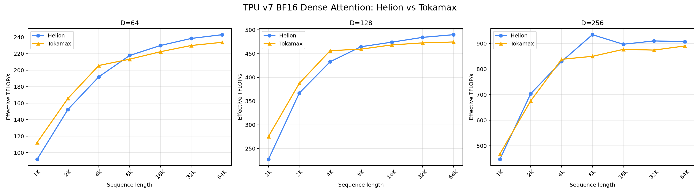
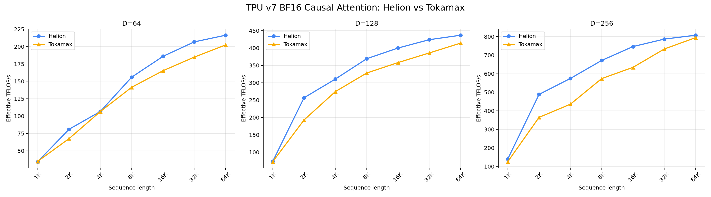

# TPU v7 attention results

Fixed-config BF16 measurements. Dense attention uses B=8/H=32; causal attention uses B=1/H=8. Speedup is Tokamax latency divided by Helion latency.

## Dense attention

| D | Sequence | Helion ms | Tokamax ms | Helion TFLOP/s | Tokamax TFLOP/s | Speedup |
|---:|---:|---:|---:|---:|---:|---:|
| 64 | 1K | 0.7465 | 0.6119 | 92.06 | 112.31 | 0.820x |
| 64 | 2K | 1.8035 | 1.6579 | 152.42 | 165.80 | 0.919x |
| 64 | 4K | 5.7296 | 5.3461 | 191.90 | 205.66 | 0.933x |
| 64 | 8K | 20.1947 | 20.6209 | 217.78 | 213.28 | 1.021x |
| 64 | 16K | 76.5191 | 79.1127 | 229.91 | 222.37 | 1.034x |
| 64 | 32K | 295.0961 | 306.0665 | 238.46 | 229.91 | 1.037x |
| 64 | 64K | 1158.3330 | 1204.1542 | 243.00 | 233.75 | 1.040x |
| 128 | 1K | 0.6045 | 0.4991 | 227.37 | 275.36 | 0.826x |
| 128 | 2K | 1.4984 | 1.4191 | 366.89 | 387.40 | 0.947x |
| 128 | 4K | 5.0798 | 4.8209 | 432.90 | 456.15 | 0.949x |
| 128 | 8K | 18.9387 | 19.1505 | 464.45 | 459.31 | 1.011x |
| 128 | 16K | 74.2209 | 75.1369 | 474.05 | 468.27 | 1.012x |
| 128 | 32K | 290.6666 | 297.8432 | 484.19 | 472.52 | 1.025x |
| 128 | 64K | 1149.3313 | 1186.4576 | 489.81 | 474.48 | 1.032x |
| 256 | 1K | 0.6144 | 0.5873 | 447.40 | 468.06 | 0.956x |
| 256 | 2K | 1.5622 | 1.6270 | 703.81 | 675.81 | 1.041x |
| 256 | 4K | 5.3018 | 5.2470 | 829.54 | 838.20 | 0.990x |
| 256 | 8K | 18.8261 | 20.7023 | 934.46 | 849.77 | 1.100x |
| 256 | 16K | 78.4453 | 80.2452 | 897.04 | 876.92 | 1.023x |
| 256 | 32K | 309.2978 | 321.9516 | 910.05 | 874.28 | 1.041x |
| 256 | 64K | 1240.7510 | 1264.6348 | 907.43 | 890.30 | 1.019x |

## Causal attention

| D | Sequence | Helion ms | Tokamax ms | Helion TFLOP/s | Tokamax TFLOP/s | Speedup |
|---:|---:|---:|---:|---:|---:|---:|
| 64 | 1K | 0.0314 | 0.0309 | 34.28 | 34.79 | 0.985x |
| 64 | 2K | 0.0531 | 0.0637 | 80.94 | 67.46 | 1.200x |
| 64 | 4K | 0.1612 | 0.1614 | 106.58 | 106.48 | 1.001x |
| 64 | 8K | 0.4408 | 0.4860 | 155.93 | 141.41 | 1.103x |
| 64 | 16K | 1.4785 | 1.6637 | 185.93 | 165.24 | 1.125x |
| 64 | 32K | 5.3174 | 5.9476 | 206.78 | 184.87 | 1.119x |
| 64 | 64K | 20.3279 | 21.7348 | 216.36 | 202.35 | 1.069x |
| 128 | 1K | 0.0292 | 0.0296 | 73.68 | 72.73 | 1.013x |
| 128 | 2K | 0.0335 | 0.0446 | 256.77 | 192.87 | 1.331x |
| 128 | 4K | 0.1107 | 0.1252 | 310.45 | 274.43 | 1.131x |
| 128 | 8K | 0.3724 | 0.4192 | 369.08 | 327.90 | 1.126x |
| 128 | 16K | 1.3750 | 1.5359 | 399.86 | 357.97 | 1.117x |
| 128 | 32K | 5.1878 | 5.7008 | 423.89 | 385.75 | 1.099x |
| 128 | 64K | 20.1419 | 21.2465 | 436.71 | 414.01 | 1.055x |
| 256 | 1K | 0.0308 | 0.0343 | 139.53 | 125.51 | 1.112x |
| 256 | 2K | 0.0352 | 0.0471 | 488.56 | 364.60 | 1.340x |
| 256 | 4K | 0.1197 | 0.1578 | 574.37 | 435.49 | 1.319x |
| 256 | 8K | 0.4094 | 0.4792 | 671.57 | 573.74 | 1.171x |
| 256 | 16K | 1.4733 | 1.7334 | 746.35 | 634.36 | 1.177x |
| 256 | 32K | 5.5910 | 5.9975 | 786.65 | 733.34 | 1.073x |
| 256 | 64K | 21.7865 | 22.1413 | 807.49 | 794.55 | 1.016x |

